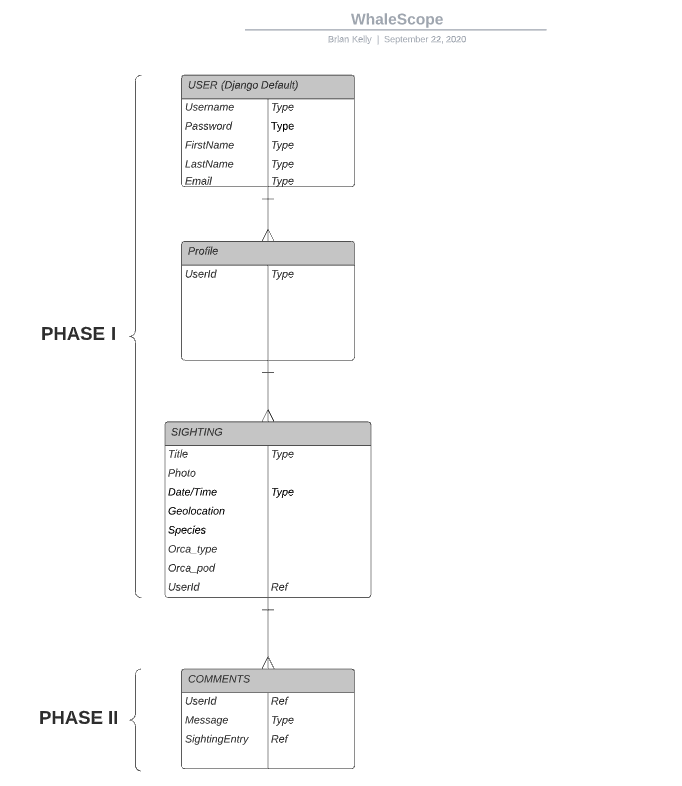
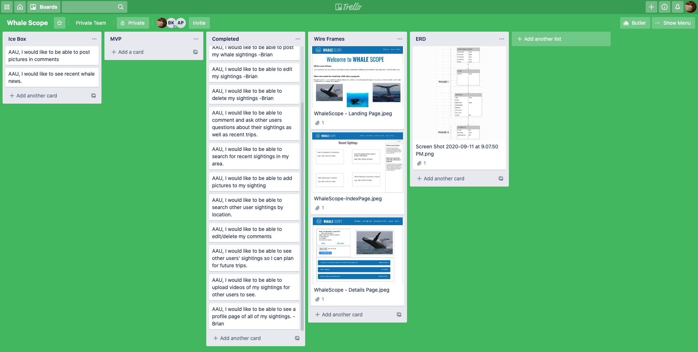
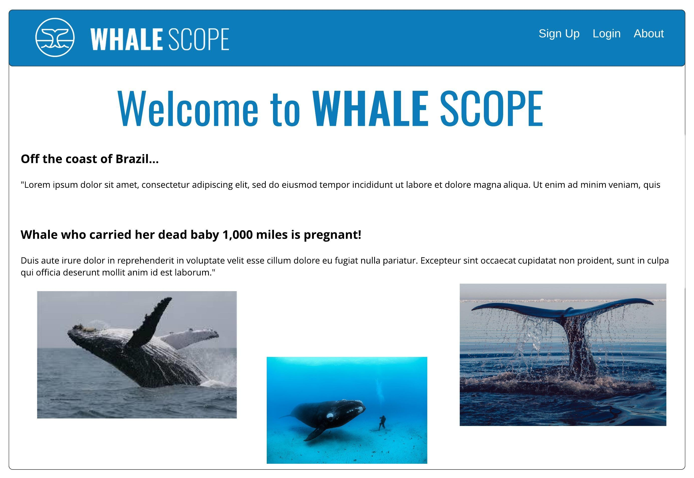
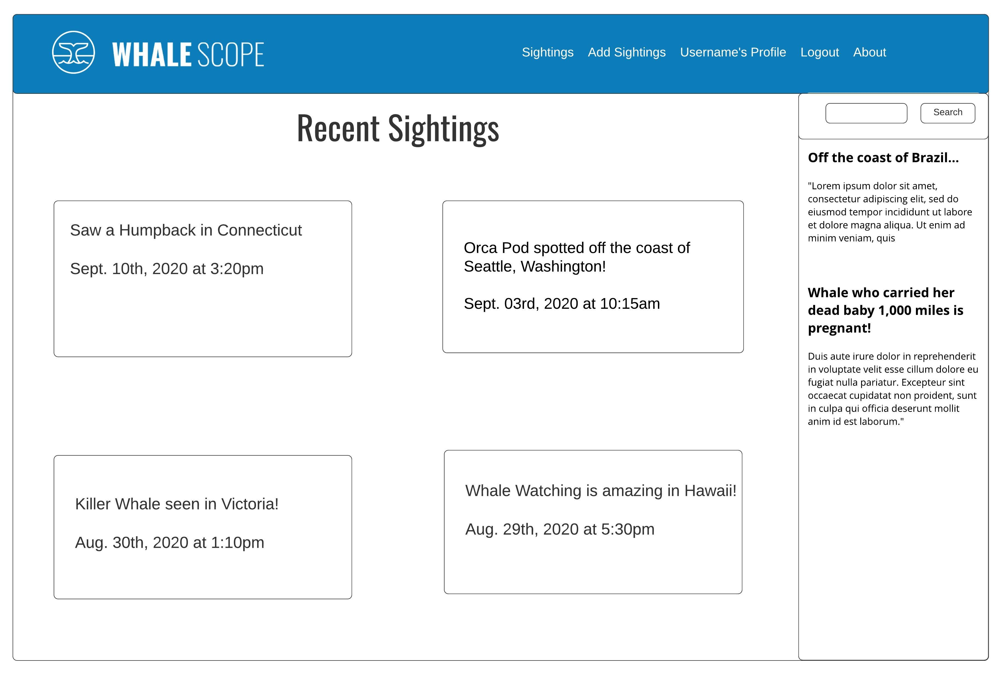
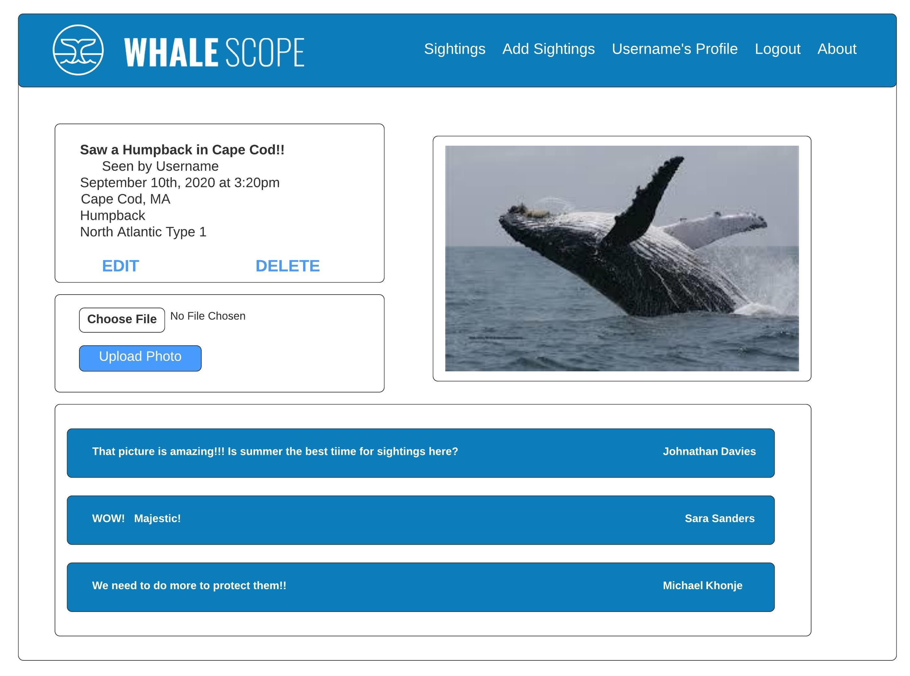
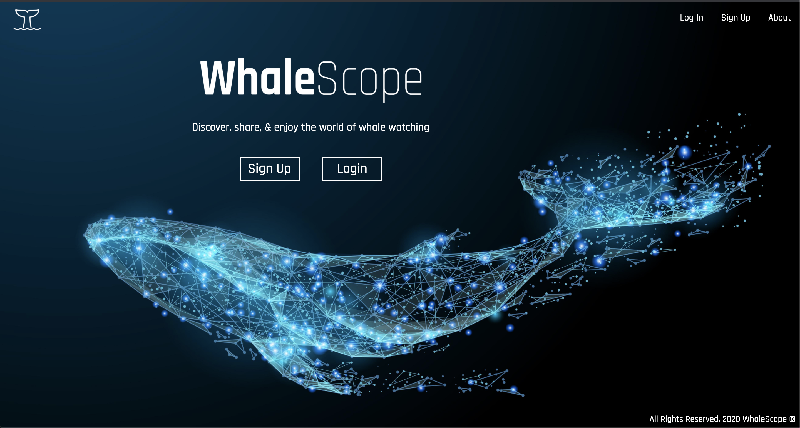
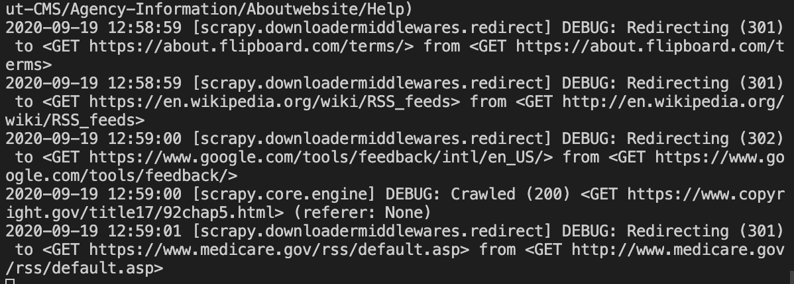
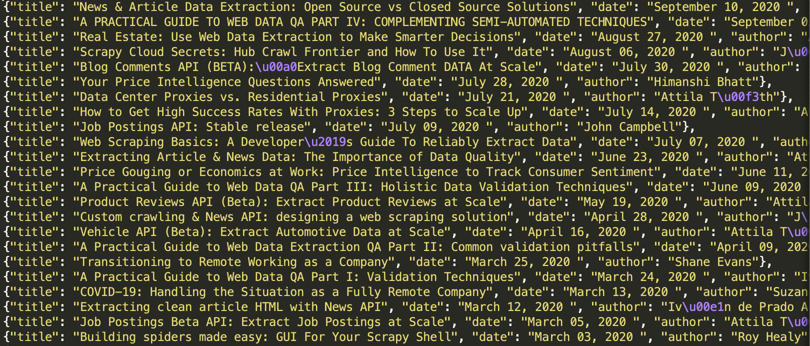

# WhaleScope

### Share Your Adventure

WhaleScope is an app where avid whale watchers can share their latest sightings and use other user's sightings to plan future trips.

# Getting Started

* Fork the repository
* Clone the file
* Install the dependencies
* Enter ```python3 manage.py runserver``` into the terminal to turn on the server
* Open your favorite browser at  ```http://localhost:8000/```
* Enjoy!

# App Inspiration

People who love whales need a place to obtain info about the best places to go whale watching and share their amazing adventures when they get back. 

# Design Inspiration

We wanted to share the true mysticism and beauty of these majestic creatures. Where better to show them then in their natural habitat. We aim to invoke the feeling of swimming with the whales while celebrating their magnificence.
 
# Languages Used
* Python
* JQuery
* Javascript
* Html

# Technologies Used
* Json
* Django
* PostgreSQL
* Boto3
* Amazon S3
* Google Maps Javascript Api
* Google Geocoding Api
* Google Geolocation Api
* The Whale Museum Api
* Heroku for Deployment

# Resolved Issues
1. The whale sighting api we wanted to use was an api written primarily with javascript. The goal was to display the sightings The Whale Museum Api had recorded on our map. Exchanging data between a javascript front end for the google maps api and a python/django backend required json packaging to make them communicate. Thank you to our instructor, Daniel Scott, for helping us accomplish this goal!! 


2.  We had a lot of issues from the beginning of our project pulling in files from each other's computers. It took 3 destroyed branches before we realized that it was a pycache/migration issue. Python creates files to keep track of the changes to files and models. Some changes create pycache files, whereas actual migrations create migration files. Since we are all on different computers, each time we saved things and migrated to our databases, we created records and then passed them to each other. An example would be the filename: 0001_initial. Since each of us had our own initial pycache, they conflicted with each other and broke our code. Once we realized it was our pycache files, we refactored our .gitignore files, rebuilt our features and were ready to continue.


# ERD


# Trello Board


# Wire Frames

### Planned Landing Screen


### Planned Index Page


### Planned Sighting's Detail Page


# Screenshots of Live App
### Landing Page


### Sighting's Index Page


### Sighting's Detail Page


# Unresolved issues

1) We wanted to have whale news that was aggregated by a webcrawler. We used the Scrapy framework and were able to get the 'spiders' to crawl though several websites and bring back information.

### Webcrawler Terminal

### Crawled Response 


We got stuck trying to pass the information through pipelines and items. It would need to pass through these files to be able to create a file django would be able to display. By the time we got this part completed, there was not enough time to finish the process.

We attempted to pivot to a newsfeed, but there were too many other features that still needed to be built to continue with that plan.

2) As for the photos in the comments, we ran out of time before our deadline. Hopefully we will be able to complete this in future versions.

3) We originally planned to have a video playing on our landing page. Our backup option being animating pictures. Neither option worked well with the django framework. However, necessity being the mother of invention, we were able to find a gorgeous picture that brings our app to life.

# Future Enhancements

In the future, we would like to be able to build the webcrawler and aggregate news about whales and other underwater mammels in a sidebar.

# Link to Live App
Click here to see [WhaleScope]()

# Developers who worked on Version 1
* Alejandra Patino - [GitHub](https://github.com/patinoale)
* Brian Kelly - [GitHub](https://github.com/brianjkelly)
* Chengusoyane Kargbo - [GitHub](https://github.com/ChenguK)

## Acknowledgments
Thank you to anyone who helped us get the app to this point.